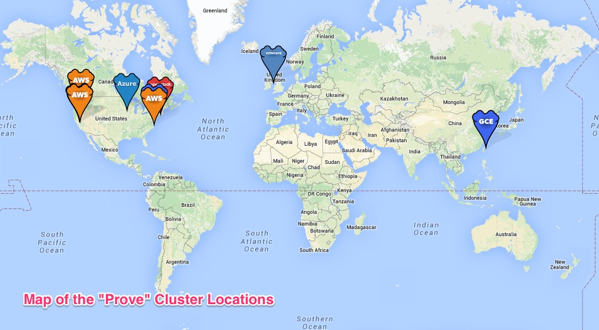

# ToDoMap Demo App

A simple NodeJS ToDo app with a twist - it can show you the source and type of provider serving the underlying REST API.

## Configuration

There is 'config.json' that maps IP addresses to implied cloud provider, region, map marker and map marker position.

## Local Deployment

Assuming you have a local MongoDb

%cp dot.env .env
%npm install
%npm start

You can edit .env to set up POSTGRES_URI and MYSQL_URI if required.

# Usage

## Database Binding

Supports Postgres, MySql and Mongo.

If env variables for none are present then an In Memory record of the To Dos is kept - clearly only useful in a single instance situation and as a starting point 

If *in-memory* is used a warning alert is placed in the UI to remind you that there is no persistence.

If you want to bind your app to a mysql provider while creating the app, you can add something like the following to continuum.conf:

services [
   {
      provider_name : "/apcera/providers::mysqlprovider",
      type: "mysql",
      service_name: "todo_mysql",
   }
]

## Cluster Locations
There is a cluster location map which shows the locations defined by the cluster.  This map relies on the config.json file, and looks for tags based on the "datacenter" tag.  The current IP is used to determine which cluster you are in, then shows the other nodes from that cluster.

The server map section of the page has also been updated to do this.  The map stays where it is, and the active node jumps around while running, while nodes are present.
